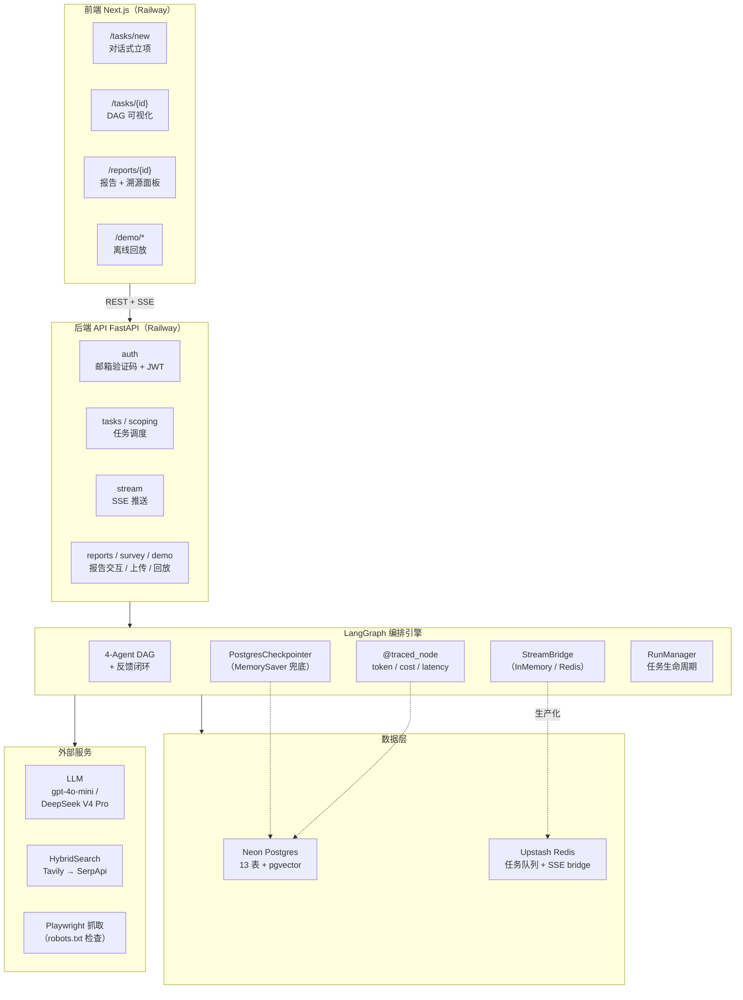
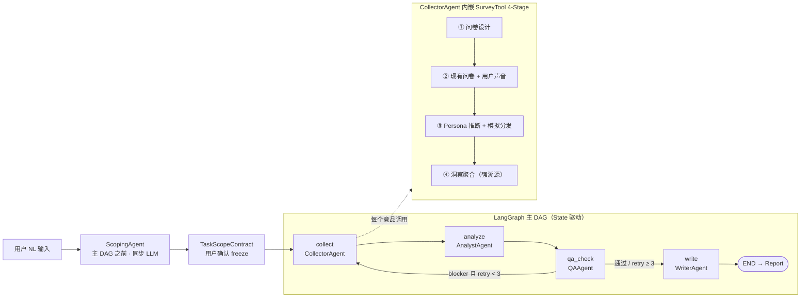

# 系统架构（Architecture）

> 本文是项目架构的**单页总览**，也是 **AI Agent 开发时的轻量入口**——读这一份即可建立全局认知，需要细节再按需 grep 对应 PRD 章节，不必通读 1800 行 PRD。
>
> **事实源仍是 [docs/PRD.md](PRD.md)**：本文的图与分层说明从 PRD §五 抽出统一存放（避免两处重复维护）；运行时工程约束、模型选型等被大量交叉引用的表格仍留在 PRD：
> - 运行时 5 条强制约束 → [PRD §五.Y](PRD.md#五y-运行时可靠性保障)
> - 模型分配与成本 → [PRD §五.X](PRD.md#五x-模型选型决策表)
> - Agent 职责与反馈闭环 → [PRD §六](PRD.md)
> - 知识 Schema（双层）→ [PRD §七](PRD.md)
> - 工程硬约束（禁 NL 通信 / 强制溯源等）→ [docs/constraints.md](constraints.md)

---

## 技术栈一览

| 层 | 技术 | 说明 |
|---|---|---|
| 前端 | Next.js 16 + React 19 + Tailwind v4 + shadcn/ui | Railway 部署 |
| 后端 API | FastAPI + Pydantic v2 | Railway 部署 |
| 编排引擎 | LangGraph（PostgresCheckpointer，MemorySaver 兜底） | State 驱动 DAG + 反馈闭环 |
| LLM | gpt-4o-mini / DeepSeek V4 Pro（Gemini 2.5 Flash 休眠可选） | 按 Agent 分配，见 [PRD §五.X](PRD.md#五x-模型选型决策表) |
| 搜索 | Tavily → SerpApi（HybridSearch 降级链） | 失败自动降级 |
| 抓取 | Playwright | 强制 robots.txt 检查 |
| 数据 | Neon Postgres（13 表 + pgvector） | 业务数据 + Trace + 向量检索 |
| 缓存/队列 | Upstash Redis | 任务队列 + SSE StreamBridge |

---

## 图 A：系统分层架构

> 按实际已落地的后端模块绘制（对照 [backend/](../backend/) 目录）。

## 图 B：多 Agent DAG 流转图

> 反映真实代码执行顺序（对照 [backend/graph/workflow.py](../backend/graph/workflow.py)）：**QA 在 Writer 之前**做数据充分性校验，不足则打回 Collector 重采（最多 3 次），达标后才让 Writer 写报告——避免在数据不足时白白消耗 Writer 的 token。

---

## 分层说明

- **前端（Next.js）**：4 个核心路由——对话式立项、DAG 实时可视化、报告交互（含一键溯源面板）、`/demo/*` 离线回放。通过 REST + SSE 与后端通信。
- **后端 API（FastAPI）**：auth（邮箱验证码 + JWT）、tasks/scoping（任务调度）、stream（SSE 推送）、reports/survey/demo（报告交互、问卷上传、演示回放）。
- **LangGraph 编排引擎**：4-Agent DAG + 反馈闭环；`PostgresCheckpointer` 支持刷新页面后任务续跑（DB 不可用时降级 `MemorySaver`）；`@traced_node` 自动记录 token/cost/latency；`StreamBridge` 解耦生产/消费（MVP 内存，生产切 Redis）；`RunManager` 管任务生命周期。详见 [PRD §五.Y](PRD.md#五y-运行时可靠性保障)。
- **外部服务**：LLM 按 Agent 分配（见 [PRD §五.X](PRD.md#五x-模型选型决策表)）；HybridSearch（Tavily 主、SerpApi 降级）；Playwright 抓取并强制检查 robots.txt。
- **数据层**：Neon Postgres 存业务数据 + `agent_traces` + pgvector 向量；Upstash Redis 做任务队列与 SSE bridge。

---

## 部署拓扑

| 服务 | 平台 | 计费 |
|---|---|---|
| Frontend (Next.js) | Railway | Hobby ~$3/月 |
| Backend (FastAPI) | Railway | Hobby ~$3-5/月 |
| Postgres + pgvector | Neon | Free Forever (3GB) |
| Redis | Upstash | Free (10K commands/天) |
| LLM | gpt-4o-mini + DeepSeek V4 Pro（Gemini 2.5 Flash 休眠可选，按 Agent 分配，见 [PRD §五.X](PRD.md#五x-模型选型决策表)） | 演示周约 $3 |
| Search API | Tavily Free / SerpApi Free | 免费额度 |

> 详细部署步骤（环境变量清单、Railway/Neon/Upstash 配置）见 `docs/deployment.md`（Week 2 部署后补）。
