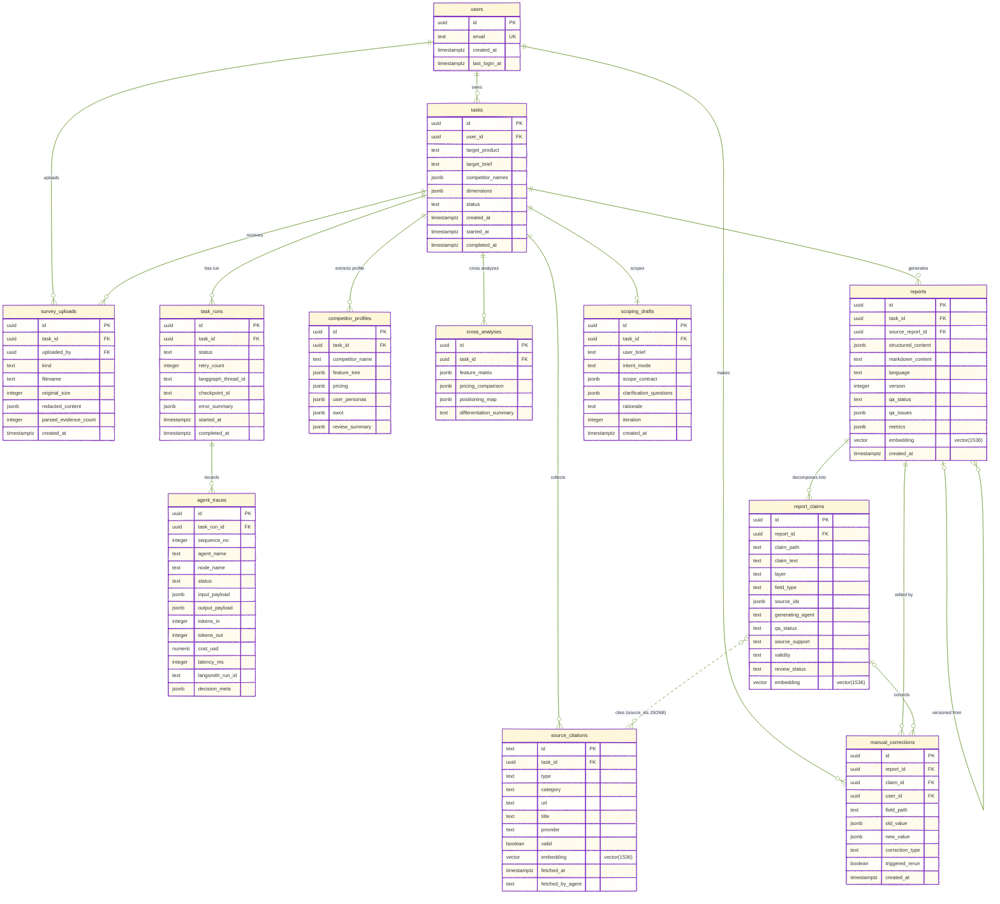

# 数据库 ER 图

> 生成依据：`字节ai全栈挑战赛徐子涵.docx`「技术材料 / 数据库 ER 图」要求，对齐项目真实落地的 `backend/db/schema.sql`、`backend/db/models.py` 与 Alembic 迁移 `0001`～`0003`。
> 数据层为 **Neon PostgreSQL + pgvector**；数据库不可用时部分运行路径会降级到内存存储，但正式持久化结构以本文为准。

## ER 图（crow's-foot 实体关系）

> 采用 Mermaid `erDiagram`（crow's-foot 记法）：每个实体框列出主键 `PK`、外键 `FK`、唯一键 `UK` 及核心业务字段；`vector(1536)` 为 pgvector 语义检索列。完整字段以 `backend/db/schema.sql` 为准。

## 关系说明

| 主体 | 关系 | 说明 |
|---|---|---|
| `users` → `tasks` | 1:N | 邮箱验证码登录后派生稳定 `user_id`，任务按用户隔离。 |
| `tasks` → `task_runs` → `agent_traces` | 1:N:N | 一个竞品分析任务可多次运行；每次运行记录 LangGraph 节点、Agent 输入输出、token、耗时、成本和 LangSmith run id。 |
| `tasks` → `source_citations` | 1:N | Collector / SurveyTool 采集的网页、搜索、评论、问卷等来源统一落库。 |
| `tasks` → `competitor_profiles` | 1:N | AnalystAgent 针对每个竞品抽取功能树、定价、画像、SWOT 和评论摘要。 |
| `tasks` → `cross_analyses` | 1:N | 跨竞品维度的功能矩阵、价格对比、定位图和差异化总结。 |
| `tasks` → `reports` → `report_claims` | 1:N:N | WriterAgent 生成报告；报告拆成可质检、可检索、可人工修正的 claim 颗粒。 |
| `reports.source_report_id` → `reports.id` | 自引用 0/1:N | 多语言或后续版本报告可追溯到源报告。 |
| `report_claims.source_ids` → `source_citations.id` | 逻辑关联（N:N） | 用 JSONB 数组保存证据 ID，一个 claim 可绑定多个来源；数据库层未建外键（图中用虚线表示）。 |
| `reports / report_claims / source_citations.embedding` | 向量检索 | `0003_add_pgvector_embeddings.py` 为三类内容添加 `vector(1536)`，支持历史报告语义检索和来源复用。 |
| `manual_corrections` → `reports / report_claims / users` | N:1 | 记录用户对报告字段或 claim 的人工修正、修正类型以及是否触发重跑。 |
| `survey_uploads` → `tasks / users` | N:1 | 存储用户上传的一手调研材料；内容写入前会脱敏。 |
| `scoping_drafts` → `tasks` | N:0/1 | ScopingAgent 在正式任务前生成结构化研究范围；未创建任务时也允许保存草稿。 |

## 索引与约束

| 对象 | 约束 / 索引 | 用途 |
|---|---|---|
| `users.email` | `UNIQUE` | 保证邮箱账号唯一。 |
| `agent_traces(task_run_id, sequence_no)` | `UNIQUE` + `idx_agent_traces_run_sequence` | 保证单次运行内 Trace 顺序稳定，支持时间轴回放。 |
| `tasks(user_id, created_at DESC)` | `idx_tasks_user_created` | 用户任务列表按创建时间倒序查询。 |
| `reports(task_id, created_at DESC)` | `idx_reports_task_created` | 单任务多版本报告查询。 |
| `report_claims(report_id)` | `idx_report_claims_report` | 报告质量指标、溯源面板和人工修正查询。 |
| `reports.embedding` | `idx_reports_embedding` | pgvector 余弦相似度检索历史报告。 |
| `report_claims.embedding` | `idx_report_claims_embedding` | pgvector 检索可复用 claim 片段。 |
| `source_citations.embedding` | `idx_source_citations_embedding` | pgvector 检索历史来源片段。 |

> 级联删除：`task_runs`、`agent_traces`、`source_citations`、`competitor_profiles`、`cross_analyses`、`reports`、`report_claims`、`survey_uploads`、`scoping_drafts` 均对父表配置 `ON DELETE CASCADE`；`manual_corrections.claim_id` 配置 `ON DELETE SET NULL`，删除 claim 时保留修正记录。

## 数据流视角

1. 用户登录后创建 `tasks`；ScopingAgent 可先写入 `scoping_drafts`，用户确认后启动正式任务。
2. `task_runs` 表示一次 LangGraph 执行，`agent_traces` 记录 Collector、Analyst、QA、Writer 等节点的可观测信息。
3. CollectorAgent / SurveyTool 写入 `source_citations` 和 `survey_uploads`，AnalystAgent 抽取 `competitor_profiles` 与 `cross_analyses`。
4. QAAgent 检查来源充分性和 Schema 完整性；WriterAgent 写入 `reports`，并拆出 `report_claims` 支撑溯源、质量面板与人工复核。
5. 用户修改报告时写入 `manual_corrections`；报告、claim、source 的 embedding 用于后续历史报告语义检索。
